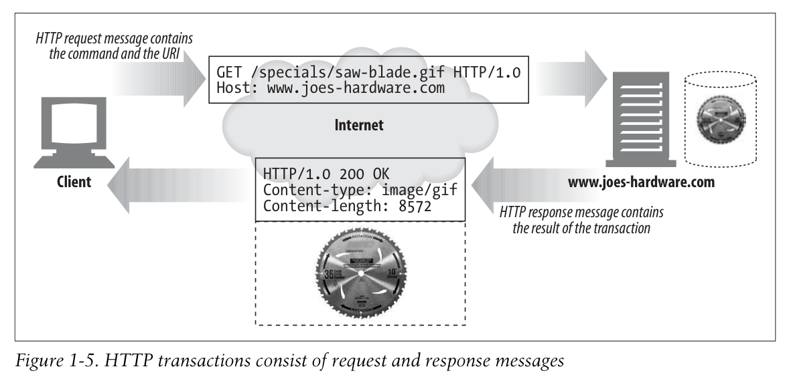
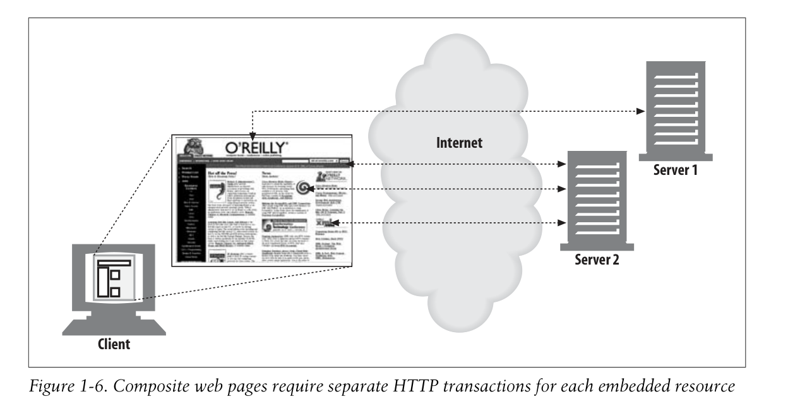

# 1.4 트랜잭션

HTTP 트랜잭션이란 request와 response로 이루어져 있다.

이 상호작용은 HTTP messages를 통해 이뤄진다.



## 메서드

다양한 리퀘스트 메서드를 지원한다.

| HTTP method | Description                |
| ----------- | -------------------------- |
| GET         | 서버로부터 named resource를 받아온다 |
| PUT         | 네임드 서버 리소스에 데이터를 저장한다.     |
| DELETE | 네임드 자원을 서버에서 지운다. |
| POST | 클라이언트 데이터를 서버 게이트웨이 앱에 보낸다 (?) |
| HEAD | HTTP 헤더만을 보낸다 (?) |

> HEAD의 쓸모는 무엇일까요?

## Status Codes

모든 HTTP 응답은 상태 코드와 함께 돌아온다. 3자릿수 숫자인데, 요청이 성공했거나, 다른 행동이 요구되는지를 알려준다.

| HTTP status code | Description |
|-|-|
| 200 | OK |
| 302 | 리디렉션. 자원을 갖기 위해 다른 곳으로 가야 한다. |
| 404 | 찾을 수 없음 |

또한 텍스트 형태의 '이유' 또한 같이 보내는데, 오직 묘사의 역할을 할 뿐 아무 역할도 하지 않고, 코드가 가장 중요하다.

```text
200 OK
200 Document attached
200 Success
200 All's cool, dude
```

위 4가지 응답은 모두 다 똑같은 의미를 가지고 있다.

## 여러 오브젝트로 이루어진 웹 페이지



다양한 서버에 있는 자원들의 모음을 필요로 할 수도 있다.
