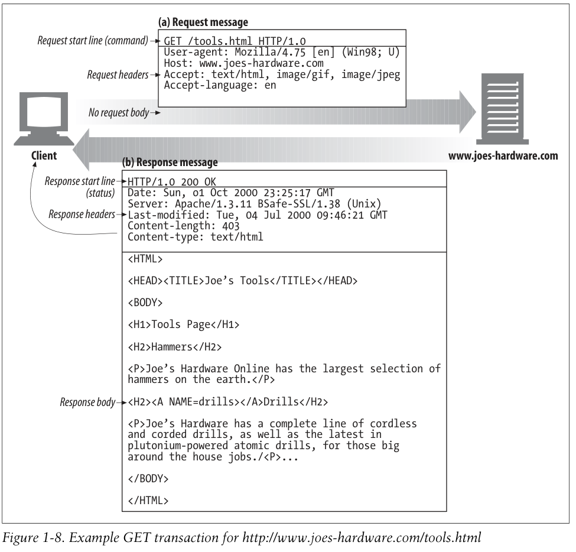

# Messages

- 사람이 읽기 쉽다.
- 클라가 서버에 보내면 request
- 서버가 클라에게 보내면 response

> HTTP 파싱이 가끔 어렵다고 불평하곤 한다. 고성능 소프트웨어를 만들 때 에러가 자주 일어난다. 하지만 많은 프로그래머들이 HTTP가 확장이 용이하고 디버깅이 편리해서 좋아한다.

세 가지로 이루어져 있다.

- Start line: 처음 메세지
- Header fields: 이름과 값으로 이뤄져 있으며, :로 구분된다. 빈 라인으로 끝난다.
- Body: 옵셔널. 바디는 이미지, 비디오, 텍스트, 아무거나 다 가능하다.

## Simple Message 예시

