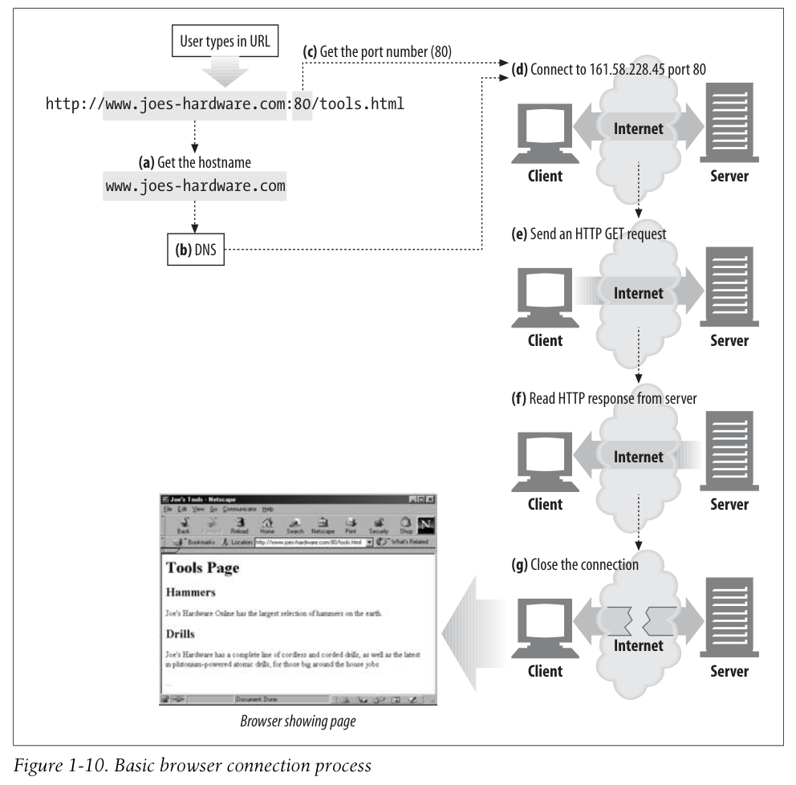

# TCP 커넥션

## TCP/IP

HTTP는 application protocol이기 때문에 세세한 구현에 신경쓰지 않는다. 대신, TCP/IP보고 알아서 하라고 한다.

- 에러 처리
- 순서 보장
- 데이터 경계 구분 x? Unsegmented data stream?

> 데이터 경계를 구분한다는 건 무슨 의미인가요? UDP는 어떤가요?

## 커넥션, IP 주소, 포트 번호

서버에 메세지를 보내기 전에 항상 IP 주소와 포트 번호를 통해 TCP/IP 연결을 성사시켜야 한다.

IP 주소와 포트 넘버를 어떻게 가져 오는가?

URL을 통해서다!

```text
http://207.200.83.29:80/index.html
http://www.netscape.com:80/index.html
http://www.netscape.com/index.html
```

두번째 URL은 숫자가 아니다. DNS를 통해서 숫자로 변경된다. 챕터 2에서 다룸.

마지막 URL은 포트 번호가 없다. 이런 경우 기본 값인 80으로 설정된다.

> 질문: 브라우저가 HTTP를 통해 어떻게 HTML 자원을 가져와서 보여주는지 설명하시오.

1. URL에서 hostname을 추출한다.
2. 호스트네임을 서버의 IP 주소로 변경한다.
3. URL에서 포트 번호를 추출한다.
4. 웹 서버와 TCP 연결을 성사시킨다.
5. request를 보낸다.
6. response를 받는다.
7. 연결이 끊기고, 브라우저에 문서를 보여준다.



## 텔넷

telnet은 원격 터미널 세션에 자주 사용되지만, HTTP 서버를 포함한 TCP 서버들에게도 연결될 수 있다.

<http://www.joes-hardware.com:80/tools.html>

여기에 연결했지만 응답을 안한다. ㅠㅠ

<https://phet-dev.colorado.edu/html/build-an-atom/0.0.0-3/simple-text-only-test-page.html>

여기에 대신 연결해보겠다.

```sh
$ telnet www.google.com 80
get /index.html http/1.1
host: www.google.com
```

이걸 해보니 잘 된다!

텔넷이 먼저 hostname을 찾아보고 connection을 성사시키고, http 메세지를 그대로 적어서 보내니 이를 http로 해석해서 response를 그대로 보내주는 것을 관찰할 수 있다.

그냥 텔넷은 별로 안 좋으니, 좀 더 가지고 놀고 싶다면 nc (netcat)을 사용해보자.
