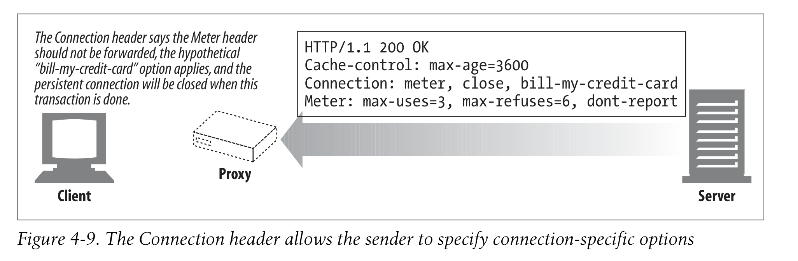
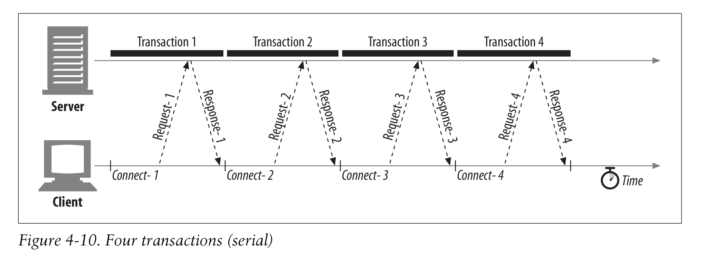

# 4.3 HTTP 커넥션 관리

앞에서는 TCP에 대해서 살펴 봤는데 이제 HTTP가 헤더 관리를 통해 어떻게 TCP를 최적화 할 수 있는지 살펴볼 것이다!

## 4.3.1 자주 오해하는 커넥션 헤더

커넥션 헤더는 다양한 타입의 토큰을 포함할 수 있기 때문에 자주 헷갈린다.

1. HTTP header field names: 오직 이 커넥션에만 관련 있는 헤더들의 이름을 나열한다.
2. Arbitrary token values: 커넥션에 대한 비표준 옵션들을 표현한다.
3. close 값: persistent connection이 끝나면 close 될 것을 암시한다.

connection token이 HTTP header 필드를 포함한다면, 오직 해당 커넥션에 관한 내용을 나열한 것이므로, 다른 라우터에 포워딩 되기 전에 지워야 한다.

> 좀 더 알아봐야 한다.

이 외에 프록시되지 않고 지워지는 몇개의 헤더들이 있다.

- Proxy-Connection
- Transfer-Encoding
- Upgrade

등등...

추가 정보를 위해 Appendix C 참고.

## 4.3.2 Serial Transaction Delays

커넥션이 직접 관리된다면 성능 저하가 발생할 수 있다.

클라이언트에서 이미지 3개를 서버에 요청할 때마다 새로 커넥션을 만들어 준다면 slow start delay가 계속 반복된다.

이를 해결하기 위해서 나온 기술들이 있는데

- Parallel connections: 여러 개의 TCP 커넥션을 통해 동시적으로 HTTP 요청
- Persistent connections: TCP 커넥션 재사용을 통해 connect/close 딜레이를 줄임
- Pipelined connections: 공유되는 TCP 커넥션을 통한 동시적인 HTTP 요청
- Multiplexed connections: 하나의 TCP 커넥션에서 여러 개의 HTTP 요청을 보낼 수 있게 하는 방법

등이 있다.
