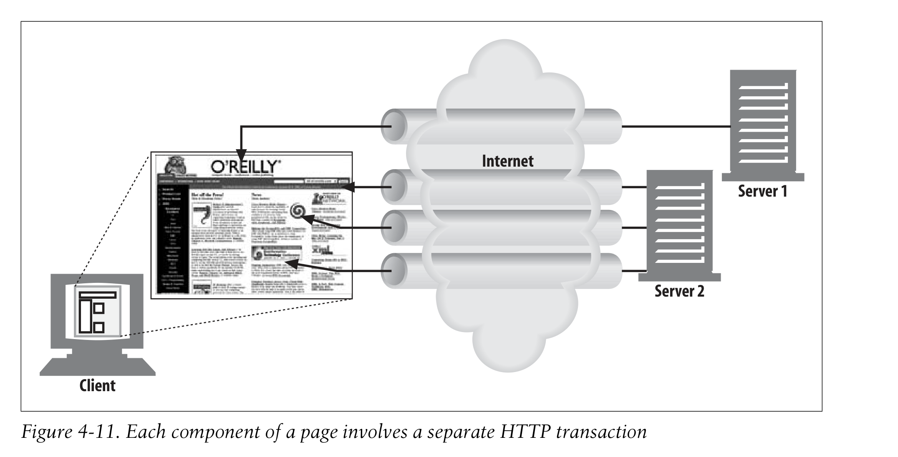
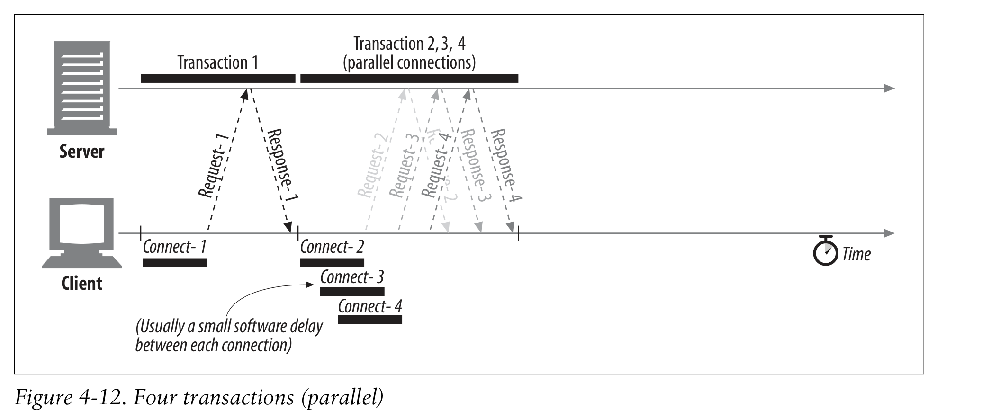

# 4.4 병렬 커넥션

동시에 여러 개의 접속을 통해 여러 개의 자원들을 가져올 수도 있다. 때문에 같은 서버에 모든 자원을 몰아넣을 필요가 없다.

## 4.4.1 병렬 커넥션이 페이지를 더 빠르게 로딩'할수도' 있다

## 4.4.2 병렬 커넥션이 항상 빠른 것은 아니다

여러 개를 열어봤자 bandwidth를 통해 경쟁하해 때문에 전체적으로 느리게 다운받을 수도 있다.

## 4.4.3 병렬 커넥션이 빠른 것처럼 '느껴질' 수도 있다

빠르지 않더라도 유저가 빠르다고 느낄 수는 있다!
