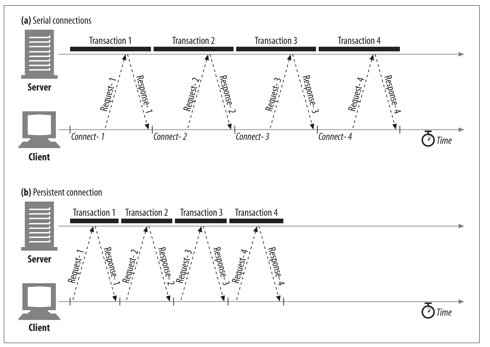

# 4.5 지속 커넥션

웹 클라이언트는 종종 같은 서버에 계속 연결을 열어둔다.

하나의 사이트에 들어가면 결국 다른 페이지로 이동할 때 똑같은 곳에서 자원을 가져올 일이 많기 때문에 재사용하면 좋다.

이걸 site locality라고 부른다.

이러한 이유 때문에 HTTP/1.1 에서는 HTTP 기기들이 같은 TCP 커넥션을 계속 다른 트랜잭션에서도 사용할 수 있도록 지원한다.

이를 통해 connection setup시간과 slow start 때문에 발생하는 지연을 피할 수 있다.

## 4.5.1 지속 커넥션 vs. 병렬 커넥션

병렬 연결이 좋긴 하지만 단점도 있다.

- 트랜잭션마다 새로운 커넥션을 열어야 하고 닫아야 한다.
- TCP slow start 때문에 느리다.
- 열 수 있는 트랜잭션 갯수에 practical limit이 존재한다.

## 4.5.2 HTTP/1.0+ Keep-Alive 연결

HTTP/1.0 Keep-Alive는 좀 상호운용성 디자인에 문제가 있어서 HTTP/1.1에 와서야 고쳐졌다.



얻을 수 있는 이점은 위와 같다. 이 외에도 slow start가 사라진다.

## 4.5.3 Keep-Alive Operation

하지만 Keep-alive는 deprecated 되었고 더 이상 문서화되지 않는다. 하지만 여전히 keep-alive handshake는 (2002년 당시) 여전히 흔하다.

HTTP/1.0 클라이언트가 Keep-alive 헤더를 보내면 서버도 Keep-alive 헤더를 응답에 담아서 보내줘야 한다.

> 이 부분은 오래되었기 때문에 20년이 지난 지금은 어떤지 파악할 필요가 있다.

## 4.5.4 Keep-Alive Options

```
Connection: Keep-Alive
Keep-Alive: max=5, timeout=120
```

이런 식으로 Connection: Keep-Alive 헤더가 존재할 경우 옵셔널 헤더를 추가할 수 있다. 둘 다 응답 헤더에 담기는데, max 는 서버가 최대 몇개의 커넥션을 유지할 수 있는지에 대한 '추정치'이고, 'timeout'은 서버가 얼마동안 connection을 유지할 지에 대한 '추정치'이다.

## 4.5.5 Keep-Alive Connection Restrictions and Rules

- Keep-alive는 HTTP/1.0에서는 기본으로 사용되지는 않는다. 직접 커넥션 헤더를 보내야 한다.
- 안 보내면 서버는 커넥션을 닫는다.
- 서버가 똑같은 헤더를 응답으로 보내지 않으면 클라이언트는 서버가 keep-alive 를 지원 안하는 것으로 해석한다.
- 응답에 Content-Length가 있거나, multipart media type이거나, 특별한 인코딩이 있어서 메세지의 바디를 connection을 끊지 않고도 알 수 있을 때만 지원할 수 있다.
- 프록시와 게이트웨이는 Connection에 대한 정보를 지워야 한다.
- 사실은 HTTP/1.0 기기로부터 온 Connection header는 다 무시되어야 한다. 왜냐하면 오래된 프록시 서버로부터 포워딩된 것일 수도 있기 때문이다. 그럼에도 어떤 클라-서버들은 이 위험을 감수하고 그냥 지원한다.
- 클라이언트는 만약 연결이 모든 요청을 받기 전에 끝난다면 다시 요청을 보낼 수 있어야 한다. (다시 보냈을 경우 side-effect가 없는 요청에 한정)

## 4.5.6 Keep-Alive와 멍청한(dumb) 프락시

### Connection 헤더의 무조건 전달
1. 클라이언트가 커넥션을 유지하기 위해 Connection: Keep-Alive 헤더와 메세지를 보낸다.
2. 멍청한 프락시는 Connection: Keep-Alive를 이해하지 못하고 서버에 메세지를 그대로 전달한다.
3. 웹 서버는 Keep-Alive 규칙에 맞게 통신을 하는 것으로 판단한다.
4. 멍청한 프락시는 Connection: Keep-Alive 헤더를 포함하고 있는 응답 메세지를 클라이언트에게 전달한다.
5. 프락시는 Keep-Alive를 모르지만, 받았던 데이터를 클라이언트에게 전달하고 나서 서버가 커넥션을 끊기를 기다린다.
6. 4번 과정처럼 클라이언트가 응답 메세지를 받으면 다음 요청을 보내기 시작하는데, 프락시는 같은 커넥션에 다른 요청이 오는 경우는 예상을 못하여 해당 요청은 무시된다.
7. 이런 잘못된 통신 때문에, 브라우저는 자신이나 서버가 타임아웃이 나서 커넥션이 끊길 때까지 기다린다.

> 이런 잘못된 통신을 피하려면, 프락시는 Connection 헤더와 Connection 헤더의 값으로 명시되지 않는 홉별 헤더들을 전달하면 안 된다.

## 4.5.7 Proxy-Connection 살펴보기

모든 웹 애플리케이션이 HTTP 최신 버전을 지원하지 않아도 멍청한 프록시 문제를 해결할 수 있도록 제시된 차선책이 Proxy-Connection 헤더이다.    
프락시가 Proxy-Connection 헤더를 전달하더라도, 웹 서버는 이걸 무시하기 때문에 별문제가 되지 않는다.      
하지만 영리한 프록시(지속 커넥션을 이해하는)라면, 의미 없는 Proxy-Connection 헤더를 Connection 헤더로 바꿈으로써 원하던 효과를 얻을 수 있다.

이 방식은 서버와 클라이언트 사이에 프록시가 단 한개 존재하는 경우에만 동작한다.    
멍청한 프락시의 양옆에 영리한 프락시가 있다면 잘못된 헤더를 만들어내는 문제가 다시 발생한다.   

## 4.5.8 HTTP/1.1의 지속 커넥션
+ HTTP/1.1은 keep-alive 커넥션을 지원하지 않는 대신, 설계가 개선된 지속 커넥션을 지원한다.   
+ HTTP/1.0과 달리, HTTP/1.1에서 지속 커넥션은 디폴트로 설정되어 있다. 별도의 설정을 하지 않는 한, 모든 커넥션은 지속 커넥션이다.
+ HTTP/1.1 애플리케이션은 트랜잭션이 끝난 후 다음 커넥션을 끊기 위해서는 Connection : close 헤더를 명시해야 한다.
  + 이것을 보내지 않는다고 해서 서버가 커넥션을 영원히 유지하겠다는 것을 뜻하지는 않는다.

## 4.5.9 지속 커넥션의 제한과 규칙
+ keep-alive와 마찬가지로 엔티티 본문은 정확한 Content-Length를 가지거나 청크 전송 인코딩되어 있어야 한다.
+ HTTP/1.1 프락시는 클라이언트와 서버 각각에 대해 별도의 지속 커넥션을 맺고 관리해야 한다.
+ 프락시 서버는 클라이언트의 커넥션 관련 지원 범위를 알고 있지 않은 한 지속 커넥션을 맺으면 안된다.
+ HTTP/1.1 애플리케이션은 중간에 끊어지는 커넥션을 복구할 수 있어야 한다.
+ 클라이언트는 전체 응답을 받기 전에 커넥션이 끊어지면, 요청을 다시 보낼 준비가 되어 있어야 한다.