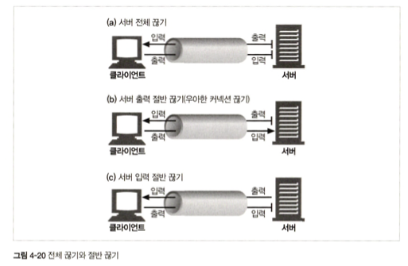

# 4.7 커넥션 끊기에 대한 미스터리

커넥션 관리에 대한 명확한 기준은 없다. 

## 4.7.1 '마음대로' 커넥션 끊기

어떠한 HTTP 클라이언트, 서버, 혹은 프락시든 언제든 TCP 전송 커넥션을 끊을 수 있다.   
예를 들어, 지속 커넥션이 일정 시간 동안 요청을 전송하지 않고 유휴 상태에 있으면 서버는 그 커넥션을 끊을 수 있다.
하지만 서버가 그 유휴 상태에 있는 커넥션을 끊은 후에, 클아이언트가 새롭게 요청 메세지를 보낸다면 문제가 생긴다.

## 4.7.2 Content-Length와 Truncation

각 HTTP 응답은 본문의 정확한 크기 값을 가지는 Content-Length 헤더를 가지고 있어야 한다.   

클라이언트나 프락시가 커넥션이 끊어졌다는 HTTP 응답을 받은 후, 실제 전달된 엔티티의 길이와 Content-Length가 일치하지 않거나, Content-Length 자체가 존재하지 않으면 수신자는 데이터의 정확한 길이를 서버에게 물어봐야 한다.

## 4.7.3 커넥션 끊기의 허용, 재시도, 멱등성

커넥션은 에러가 없더라도 언제든 끊을 수 있다. 어떤 요청 데이터가 전송되었지만, 응답이 오기 전에 커넥션이 끊기면 클라이언트는 실제로 서버에서 얼만큼 요청이 처리되었는지 전혀 알 수 없다.

클라이언트는 POST와 같이 멱등이 아닌 요청은 파이프라인을 통해 요청할 수 없다.   
비멱등인 요청을 다시 보내야 한다면, 이전 요청에 대한 응답을 받을 때까지 기다려야 한다.

## 4.7.4 우아한 커넥션 끊기

TCP 커넥션은 양방향이다. 입력 큐와 출력 큐가 각각 하나씩 양쪽 끝에 존재한다.   

보통은 출력 채널을 먼저 끊는 것이 안전하며, 이걸 "우아한 커넥션 끊기"라고 한다.

### 전체 끊기와 절반 끊기

애플리케이션은 TCP 입력 채널과 출력 채널 중 한개만 끊거나 둘 다 끊을 수 있다.   
+ close(): TCP 입력 채널과 출력 채널 모두 끊기
+ shutdown(): 입력 채널과 출력 채널 중 한개만 끊기

### TCP 끊기와 리셋 에러

애플리케이션이 각기 다른 HTTP 클라이언트, 서버, 프록시와 통신할 때, 그리고 그들과 파이프라인 지속 커넥션을 사용할 때, 기기들에 예상치 못한 쓰기 에러가 발생하는 것을 예방하기 위해 '절반 끊기'를 사용해야 한다.

+ 보통은 커넥션의 출력 채널을 끊는 것이 안전하다.
   + 클라이언트는 모든 데이터를 버퍼로부터 읽고 나서 데이터 전송이 끝남과 동시에 서버가 커넥션을 끊었다는 사실을 알게 될 것이다.
+ 커넥션의 입력 채널을 끊는 것은 위험하다. 
   + 만약 클라이언트가 이미 끊긴 입력 채널에 데이터를 전송하면, 서버의 운영체제는 'connection reset by peer'라는 메세지를 클라이언트에 보낼 것이다.
   + 대부분 운영체제는 이것을 심각한 에러로 취급하여 버퍼에 저장된, 아직 읽히지 않은 데이터를 모두 삭제해버린다.

### 우아하게 커넥션 끊기

우아한 커넥션 끊기란, 애플리케이션이 자신의 출력 채널을 먼저 끊고, 다른쪽에 있는 기기의 출력 채널이 끊기는 것을 기다리는 것이다.        

커넥션을 우아하게 끊고자 하는 애플리케이션은 출력 채널을 끊은 후, 데이터 전송이 끝났는지 확인하기 위해 입력 채널에 대해 상태 검사를 주기적으로 해야 한다.