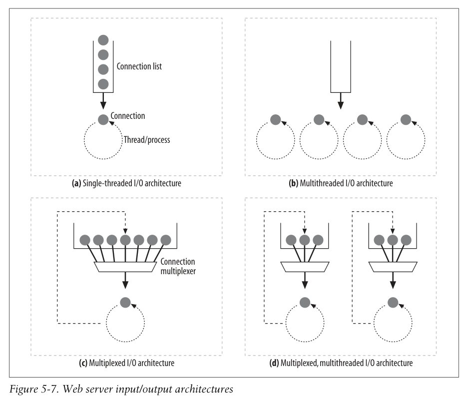

# 5.5 요청 메시지 수신

- request line 파싱
  - request method
  - URI
  - version number
- message header 파싱
- \r\n\r\n
- 바디 파싱 (Content-Length header에 적혀있는 만큼)

## 내부 표현

파싱한 다음 내부 자료구조로 저장해두는 경우가 많다.

## 연결 I/O 프로세싱

몇천개의 동시 커넥션을 지원할 수 있어야 한다.

> C10K 문제?

### Single-threaded web servers

### Multiprocess and multithreaded web servers

### Multiplexed I/O servers

여러 개의 커넥션을 돌면서 데이터가 왔거나 어떤 이벤트가 발생했을때만 실행하고 실행을 마치면 다시 open connection list에 반납하는 방식으로 동작.

> Event-driven 방식으로 동작하는 async 웹 서버를 칭하는 듯 한다. 당시에는 event-driven, async 등의 용어가 잘 알려지지 않았을 수도 있다.

### Multiplexed multithreaded web servers

