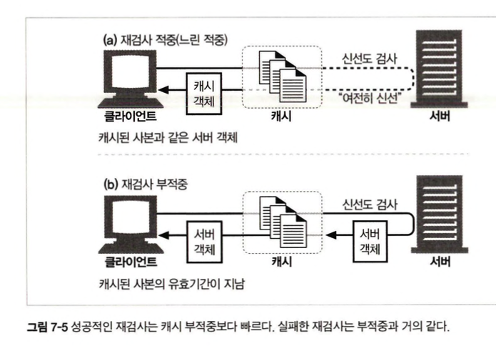
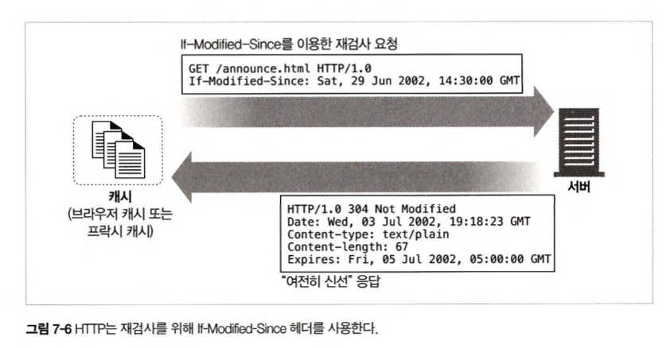

# 7.5 적중과 부적중
캐시가 모든 문서의 사본을 저장하지는 않는다.
+ 캐시 적중 : 캐시에 요청이 도착했을 때, 그에 대응하는 사본이 있다면 그를 이용해 요청이 처리한다.
+ 캐시 부적중 : 대응하는 사본이 없다면 그냥 원 서버로 전달한다.

## 7.5.1 재검사
+ 원 서버 콘텐츠는 변경될 수 있기 때문에, 캐시는 반드시 그들이 갖고 있는 사본이 여전히 최신인지 서버를 통해 점검해야 한다.     
+ 대부분의 캐시는 클라이언트가 사본을 요청하였으며, 그 사본이 검사를 할 필요가 있을 정도로 충분히 오래된 경우에만 재검사를 한다.
+ 재검사 적중(느린 적중): 재검사 시 콘텐츠가 변경되지 않았다면, 서버는 아주 작은 304 Not Modified 응답을 보낸다. 그 사본이 여전히 유효함을 알게 된 캐시는 즉각 사본이 신선하다고 임시로 다시 표시한 뒤 사본을 클라이언트에 제공한다.

재검사를 위해 가장 많이 쓰이는 도구는 If-Modified-Since 헤더다.    
GET If-Modified-Since 요청이 서버에 도착하는 경우 세가지 상황이 발생할 수 있다.
1. 서버 콘텐츠가 변경되지 않은 경우
2. 서버 콘텐츠가 변경된 경우
3. 객체가 삭제된 경우

+ **재검사 적중**: 서버 객체가 변경되지 않았다면, 서버는 아주 작은 304 Not Modified 응답을 보낸다.
+ **재검사 부적중**: 서버 객체가 캐시된 사본과 다르다면, 서버는 콘텐츠 전체와 함께 HTTP 200 OK 응답을 클라이언트에게 보낸다.
+ **객체 삭제**: 서버 객체가 삭제되었다면, 서버는 404 Not Found 응답을 돌려보내며, 캐시는 사본을 삭제한다.

## 7.5.2 적중률
캐시가 요청을 처리하는 비율을 캐시 적중률 또는 문서 적중률이라고 한다.     
+ 0%는 모든 요청이 캐시 부적중이며, 100% 는 모든 요청이 적중된 경우다.
+ 캐시 적중률이 40% 면 웹 캐시로 괜찮은 편이다.

## 7.5.3 바이트 적중률
바이트 단위 적중률은 캐시를 통해 제공된 모든 바이트의 비율을 표현하며, 이 측정값은 트래픽이 절감된 정도를 포착해낸다.
+ 바이트 단위 적중률 100% 는 모든 바이트가 캐시에서 왔으며, 어떤 트래픽도 인터넷으로 나가지 않았음을 의미한다.

## 7.5.4 적중과 부적중의 구별
HTTP는 클라이언트에게 응답이 캐시 적중이었는지, 아니면 원 서버 접근인지에 대해서 표현해주지 않는다.
두 경우 모두 응답코드는 200 OK로 전달된다.

클라이언트가 응답이 캐시에서 왔는지 알아내는 방법은 Date헤더 와 Age헤더를 통해 알 수 있다.
+ 응답의 Date 헤더 값을 현재 시각과 비교하여 응답의 생성일이 더 오래되었다면 클라이언트는 응답이 캐시된 것임을 알아낼 수 있다.
+ 응답이 오래되었는지 말해주는 Age 헤더를 통해서도 알 수 있다.

