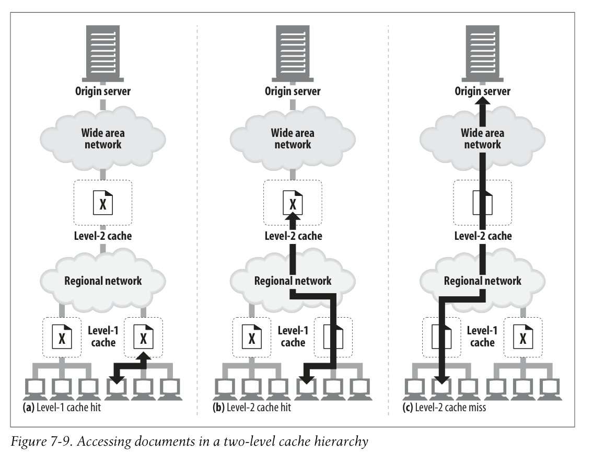
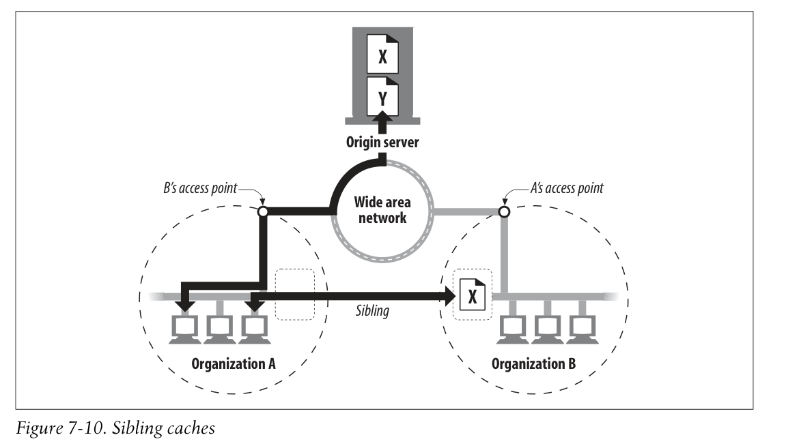

# 7.6 캐시 토폴로지

## Private Caches

브라우저에서 저장해주는 개인적인 캐시 파일들

## Public Proxy Caches

네트워크 트래픽을 줄여준다.

6장에서 설명된 것처럼

- manual proxy
- proxy auto-configuration file
- intercepting proxies

들을 설정해서 사용할 수 있다. (20장 참고)

## Proxy Cache Hierarchies

캐시 간의 계층 구조를 두는 것이 유용할 수 있다.

우선 가까이에 있는 작은 캐시들을 찾아보고, 캐시 미스가 발생하면 조금 멀리 떨어진 레벨 2 큰 캐시를 찾아보는 식으로 접근할 수 있다.

## Cache Meshes, Content Routing, and Peering

캐시 계층보다 조금 더 복잡한 캐시 메시 구조를 채택할 수도 있다.

매시들끼리 서로 의사소통해서, 요청 별로 부모 캐시로 보낼 것인지 아니면 바로 origin 서버로 보낼 것인지를 효율적으로 결정한다.

캐시 매시는 다음과 같이 동작한다.

- URL에 따라 parent cache로 가야할지, 원 서버로 가야할지 동적으로 결정한다.
- parent cache로 간다면 어떤 부모 캐시로 가야할지 동적으로 결정한다.
- 부모 캐시에 접근하기 전에 로컬에 요청된 부분에 대한 캐시가 존재하는지 탐색한다.
- 다른 캐시들에게 자기 자신의 캐시된 내용의 일부에 접근을 허용한다. 하지만 인터넷 전송은 금지한다. (?)

sibling cache란 무엇인가?

선택적으로 동료들에게 도움을 주는 캐시

HTTP가 sibling cache를 지원하지 않기 때문에 ICP, HTCP와 같은 프로토콜이 나왔다. 20장에서 추가로 다룬다.
