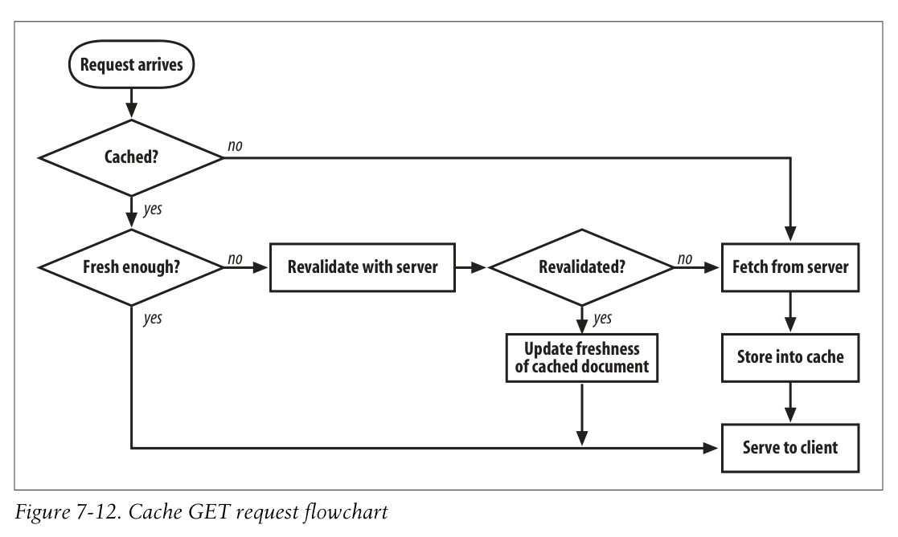

# 7.7 캐시 처리 단계

7가지 단계로 나뉜다.

## Step 1: Receiving

캐시가 요청 메세지를 네트워크로부터 받는다.

## Step 2: Parsing

요청을 파싱해서 URL과 헤더를 얻는다.

## Step 3: Lookup

로컬 카피가 존재하는지 찾아보고, 없으면 다운로드 받고 로컬에 저장한다.

## Step 4: Freshness Check

다운 받은 캐시가 충분히 신선한지 확인하고, 아니라면 서버에게 업데이트를 요청한다.

요청 헤더에 캐시가 revalidate하는 것을 강제하거나, validation을 안 하도록 강제할 수 있다.

신선도를 어떻게 파악하는지에 대해 이 장의 대부분을 할애할 것이다.

## Step 5: Response Creation

캐시가 응답 메세지를 만든다. 새로운 헤더와 바디를 넣는다.

Cache freshness information을 집어넣는다. Cache-Control, Age, Expires headers등을 넣는다.
프록시 캐시가 해당 응답을 만들었다는 것을 명시하기 위해 때로는 Via 헤더도 넣는다.

캐시는 절대 Date 헤더를 건드려서는 안된다. Date는 해당 객체가 원 서버에 의해 언제 만들어졌는지를 표시한다.

## Step 6: Sending

클라이언트에게 응답을 보낸다.

## Step 7: Logging

선택적으로, 해당 트랜잭션에 대한 로그를 남긴다.

## Cache Processing Flowchart

