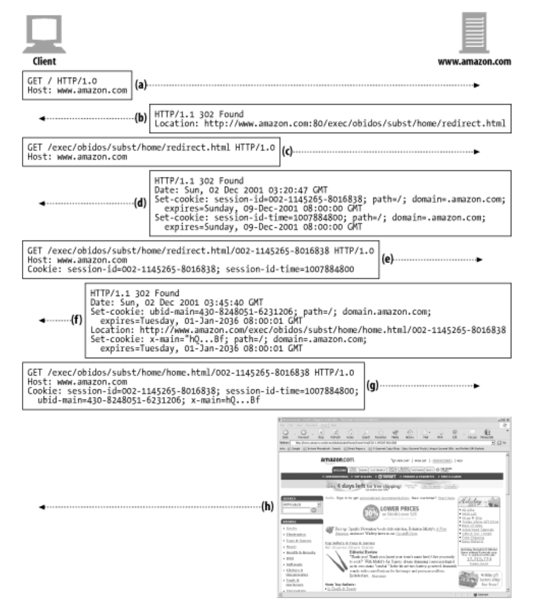

# 11.6 쿠키
- 쿠키는 USER를 식별하고 세션을 유지하는 방식 중 현재까지 가장 널리 사용하는 방식

### 11.6.1 쿠키의 타입
**세션 쿠키** 
- 관련된 설정과 선호 사항을 저장하는 임시 쿠키
- 브라우저 닫으면 삭제된다.
- Discard가 설정되어있지 않거나 파기 시점을 가리키는 Expire, Max-Age 파라미터를 사용하지 않는다.

  
**지속 쿠키** 
- USER가 주기적으로 방문하는 사이트의 설정 정보나 로그인 이름을 유지하기 위해 사용
- 디스크에 저장되어 브라우저 닫아도 삭제되지 않는다.
- Discard가 설정되어 있거나 파기 시점을 가리키는 Expire, Max-Age 파라미터를 사용한다.

### 11.6.2 쿠키는 어떻게 동작하는가
- 첫 사이트 방문시, 웹서버는 USER에 대해서 아무것도 모른다. (그림 11-3)
- 웹 서버는 User가 다시 돌아왔을 때, 해당 USER를 식별하기 위한 유일한 값을 쿠키에 할당한다
- 쿠키는 임의의 이름 = Value 형태의 리스트를 가지며 리스트는 Set-Cookie혹은 Set-Cookie2(확장 헤더) 같은 HTTP 응답 헤더에 기술되어 USER에게 전달된다.

### 11.6.3 쿠키상자:클라이언트 측 상태
**HTTP 상태 관리 체계** : 클라이언트 측 상태의 공식적인 이.
- 쿠키는 브라우저가 서버 관련 정보를 저장하고, USER가 해당 서버에 접근할 때마다 그 정보를 함께 전송하게 한다.

#### 구글 크롬 쿠키
- SQlite 파일에 쿠키 저장.

#### MS 익스플로러 쿠키
- 캐시 디렉터리에 각각의 개별 파일로 쿠키를 저장.

### 11.6.4 사이트마다 각기 다른 쿠키들
---
브라우저는 엄청난 개수의 쿠키를 가질 수 있지만 아래의 이유로 **모든 쿠키를 사이트에 보내지 않는다.**

1. **성능 저하**
    
    : 실제보다 더 많은 쿠키 바이트를 전달해야 함으로 성능 저하를 일으킨다.
    
2. **무의미한 값 전달**
    
    : 쿠키들은 대부분 서버에 특화된 이름/값 쌍을 포함하고 있어 대부분의 사이트에서 인식하지 않는 무의미한 값이다.
    
3. **개인정보 문제**
    
    : 신뢰하지 않는 사이트에서 쿠키를 가져갈 수 있다.
    
<br/>

**쿠키와 광고**

: 웹 사이트의 광고는 협력 업체가 담당하는데, 이는 지속 쿠키로 이뤄진다.
    
**[ How To ]**
    
    1. 사용자가 사이트에 방문
    2. 브라우저는 앞서 만든 지속 쿠키를 광고사 서버로 보냄. (지속 쿠키)
    3. 광고사는 사용자 프로필, 사이트 사용 습관 등 데이터 수집
    4. 최신 브라우저는 설정 기능을 통해 제약을 가할 수 있음.
        
    
- **쿠키 Domain 속성**
    
    : 쿠키 생성시 Set-Cookie 응답 헤더에 Domain 속성 기술 후 **어떤 사이트가 그 쿠키를 읽을 수 있는지** 제어.
    
    ```html
    Cookie: user="mary17"
    ```
    
- **쿠키 Path 속성**
    
    : 웹 사이트의 일부(**특정 문서**)에만 쿠키 적용.
    
    ```html
    Set-cookie: pref=compact; domain="airtravelbargains.com"; **path=/autos/**
    ```
    
    e.g.) http://www.airtravelbargains.com/specials.html에 접근하면
    
    ```html
    Cookie: user="mary17"
    ```
    
    를 얻음.
    
    e.g.) http://www.airtravelbargains.com/autos/cheapo/index.html에 접근하면
    
    ```html
    Cookie: user="mary17"
    Cookie: pref=compact
    ```
    
    를 얻음.
    
    ⇒ **쿠키**는 **일종의 상태 정보**
    
    : 서버가 생성 → 클라이언트에 전달 → 유효한 사이트에만 쿠키 전달 (클라이언트)
    

<br/>

### 11.6.5 쿠키 구성요소

---

- **Version 0 쿠키** (= 넷스케이프 쿠키)
- **Version 1 쿠키** (’RFC 2965’)

### 11.6.6 Version 0(넷스케이프) 쿠키

---

 : **Set-Cooke 응답 헤더**와 **Cookie 요청 헤더**와 **쿠키를 조작**하는데 필요한 필드들 정의

→ **최초의 쿠키 명세**

**[ Set-Cookie 속성 ]**

- **이름=값**
    - **필수 속성**
    - 사용자가 추후 **웹 서버에 다시 방문하면 읽어올** 그 어떤 이름=값 조합이든 만들 수 있다.
    - ‘이름’과 ‘값’ 모두 큰따옴표로 감싸지 않은 세미콜론, 쉼표, 등호 공백을 포함하지 않는 문자열.
    
    ```html
    Set-Cookie: customer=Mary
    ```
    
- Expires
    - 선택적인 속성
    - **쿠키의 생명주기**를 가리키는 **날짜 문자열**을 기술.
    - 파기 일자에 다다르면, 그 쿠키는 삭제될 것이며 전달되지도 않을 것.
    
    ```html
     // 지속 쿠키
    요일, DD-MM-YY- HH:MM:SS GMT
    
    // 세션 쿠키
    // Expires를 명시하지 않으면 그 쿠키는 사용자 세션이 끝날 때 파기될 것이다.
    
    // 예시
    Set-Cookie: foo=bar; expires=Wednesday, 09Nov-99 23:12:40 GMT
    ```
    

- **Domain**
    - 선택적인 속성
    - 기술된 도메인을 사용하는 서버 호스트 명으로만 쿠키를 전송.
    - **특정 도메인**에만 쿠키를 제한적으로 전달.
    
    ```html
    Set-Cookie: SHIPPING=FEDEX' domain="joes-hardware.com"
    ```
    
- **Secure**
    - 선택적인 속성
    - 서버에 있는 **특정 문서**에만 쿠키를 할당할 수 있다.
        
        (기술된 값이 URL 경로의 앞부분과 일치하면, 쿠키를 전달.)
        
    
    ```html
    Set-Cookie: lastorder=00183; path=/orders
    ```
    
- **Path**
    - 선택적인 속성
    - **HTTP가 SSL 보안 연결**을 사용할 때만 쿠키를 전송
    
    ```html
    Set-Cookie: private_id=519; secure
    ```
    

### 11.6.7 Version 1 (RFC 2965) 쿠키

---

 : Set-Cookie2와 Cookie2 헤더를 소개하고 있으며, Version 0과도 호환된다.

**[ Set-Cookie2 속성 ]**

- **이름=값**
    - **필수 속성**
    - 웹 서버에 다시 방문했을 때 돌려받을 수 있는 어떤 ‘이름=값’ 조합.
- **Version**
    - **필수 속성**
    - 쿠키 명세의 버전을 가리키는 정수 값
- **Comment**
    - 선택적인 속성
    - 서버가 쿠키를 사용하려는 의도를 기술
- **CommentURL**
    - 선택적인 속성
    - 상세히 기술된 웹페이지 URL 링크 제공.
- **Discard**
    - 선택적인 속성
    - 클라이언트 프로그램이 종료될 때 클라이언트가 해당 쿠키 삭제.
- **Domain**
    - 선택적인 속성
    - 기술된 도메인에 해당하는 서버 호스트들에게만 쿠키 전송.
- **Max-Age**
    - 선택적인 속성
    - 쿠키의 생명주기를 초 단위로 산정한 정수 값.
- **Path**
    - 선택적인 속성
    - 서버에 있는 특정 문서에만 쿠키 할당.
- **Port**
    - 선택적인 속성
    - 포트 목록에 있는 포트에 해당하는 서버로만 쿠키 전달.
- **Secure**
    - 선택적인 속성
    - HTTP가 SSL 보안 연결을 사용할 때만 쿠키가 전송.

[ 추가된 변경사항 ]

- 쿠키마다 **목적을 설명**하는 설명문 존재.
- 브라우저가 닫히면 쿠키를 **강제로 삭제** 가능.
- 초 단위의 상대 값으로 쿠키의 생명 주기를 결정할 수 있는 **Max-Age** 존재.
- URl의 **포트번호**로도 쿠키 제어 가능. (기존의 도메인 경로로도 가능.)
- Cookie 헤어에 **도메인, 포트, 경로 필터**를 함께 담아 반환.
- 호환되는 **버전 번호**.
- Cookie 헤더에 **$ 접두어** 존재. (사용자 이름과 추가적인 키워드 구별위해.)

- Version 1 Cookie 헤더
    - 각 쿠키에 해당 쿠키의 필터 중 현재 사이트에 들어맞는 필터를 ‘$’를 붙여 기술.
    
    ```html
    [ 웹 사이트에서 받은 응답 ]
    Set-Cookie2: ID="29046"; Domain=".joes-hardware.com"
    Set-Cookie2: color=blue
    Set-Cookie2: support-pref="L2"; Domain="customer-care.joes-hardware.com"
    Set-Cookie2: Cupon="hammer027"; Version="1"; Path="/tools"
    Set-Cookie2: Cupon="handvac103"; Version="1"; Path="/tools/cordless"
    
    [ 전송할 헤더 ]
    Cookie: $Version="1";
    		ID="29046"; $Domain=".joes-hardware.com";
            color="blue"
            Cupon="hammer027" $Path="/tools"
            Cupon="handvac103"; $Path="/tools/cordless"
    ```
    

- Version 1 Cookie2 헤더 **버전 협상**
    
    **[ 서버 ]**
    
    - **최신 버전 수용**
        
        → ‘Set-Cookie’와 ‘Set-Cookie 2’ 중 ‘Set-Cookie 2’를 받아들임.
        
    
    **[ 클라이언트 ]**
    
    - **이전 버전 수용**
        
        → ‘Set-Cookie’와 ‘Set-Cookie 2’ 중 ‘Set-Cookie’를 받아들임.
        

### 11.6.8
---


### 11.6.9 쿠키와 캐싱
---

**쿠키** 트랜잭션과 관련된 문서를 **캐싱**하는 경우 발생될 수 있는 문제점!

    → 이전 사용자의 쿠키가 **다른 사용자에게 할당.**

    → 누군가의 개인 정보가 다른 이에게 **노출**.

<br/>


[ 이를 방지하기 위해 **유의할 점** ]

- 캐시되지 말아야 할 문서가 있다면 **표시**하라.
    
    ```html
    Cache-Controll: no-cache="Set-Cookie" // 캐시하면 안되는 문서
    Cache-Controll: public // 캐시해도 되는 문서
    ```
    
- **Set-Cookie 헤더를 캐시**하는 것에 유의하라.
    - 같은 **Set-Cookie 헤더를 여러 사용자**에게 보내게 되면, **사용자 추적에 실패**.
    - 어떤 캐시는 응답을 저장하기 전에 Set-Cookie 헤더를 제거하기 때문에, 그 캐시 데이터를 받는 클라이언트는 Set-Cookie 헤더 정보가 없는 데이터를 받게 되어 문제가 발생.
        
        ⇒ **모든 요청마다 원 서버와 재검사**시켜 클라이언트로 가는 응답에 Set-Cookie 헤더 값을 기술해서 문제 개선 가능.
        
    
    ```html
    Cache-Control: must-revalidate, max-age=0
    ```
    
- **Cookie 헤더를 가지고 있는 요청**을 주의하라.
    - 결과 콘텐츠가 개인정보를 담고 있을 수도 있다.
        
        → 효율적인 방식은 파기 시간이 0인 Cookie 헤더를 설정해서 **매번 재검사하도록 강**제하기!
        

### 11.6.10 쿠키, 보안 그리고 개인정보

---

- 쿠키를 사용하는 것이 보안상으로 엄청나게 위험한 것은 아니다.
    
    → 쿠키를 사용하지 않도록 **비활성**화 시킬 수 있고, **로그 분석** 같은 다른 방법으로 대체하는 것도 가능
    
- 원격 **DB에 개인 정보를 저**장하고 해당 데이터의 **키 값을 쿠키에 저장**하는 방식을 표준으로 사용하면, 클라이언트와 서버 사이에 예민한 데이터가 오가는 것을 줄일 수 있다.
- 가장 **큰 오용** 중 하나는 협력업체 웹 사이트가 **사용자를 추적하려고 지속 쿠키를 사용하는 것**이다.
    
    → IP 주소와 Referer 헤더의 정보를 사용하면 꽤 정확한 사용자 데이터 수집 가능.
    

⇒ 쿠키에 대해 부정적인 여론이 많지만, 제공하는 **개인정보를 누가 받는지 명확히 알고** 사이트의 **개인 정보 정책만 유의**하면 **세션 조작이나 트랜잭션 상의 편리함이 더 크다.**
