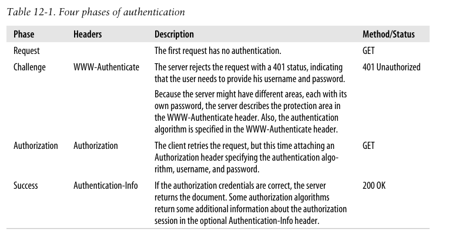
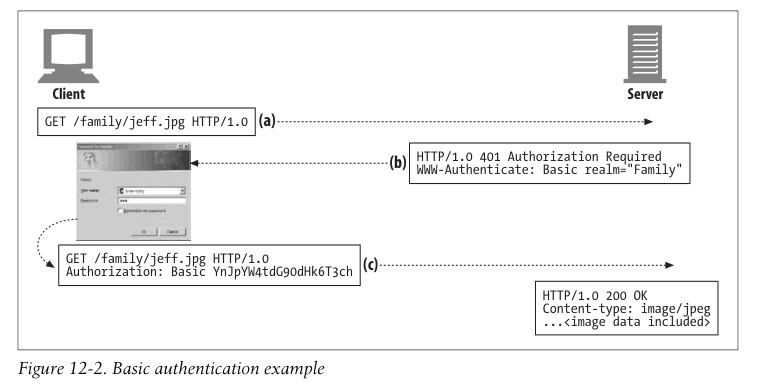
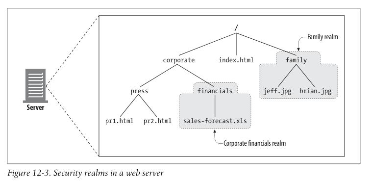

# 인증

> 브라우저 상단에 유저 이름과 비번을 물어보는 프롬프트가 가끔 뜰 때가 있는데, 그게 무엇인지를 설명하는 챕터인 듯 합니다.
> UI가 별로 좋지 않고, 여러 기능들이 없기 때문에 현대 웹이서 자주 쓰이지 않는다고 합니다!

이번 장은 기본 인증이 무엇인가에 대해 다뤄본다.

인증이란 무엇인가?

정체에 대한 증거를 보이는 것이다.

## HTTP's Challenge/Response Authentication Framework

HTTP는 네이티브 도전 과제를 지원한다.

1. 클라: 비밀 정보를 주세요
2. 서버: 이건 유저 이름과 비밀번호가 필요해요.
3. 클라: 비밀 정보를 주세요. 여기 제 이름과 비밀번호가 있어요.
4. 서버: 여기 있습니다.

## Authentication Protocols and Headers

다양한 인증 프로토콜을 지원한다.

컨트롤 헤더를 바꿈으로서 이를 제어한다.

만약 기본 인증이 필요한 요청이라면
WWW-Authenticate 헤더와 401 코드를 보내 추가적인 정보를 요청한다.

## Security Realms

위 사진에서 WWW-Authenticate과 함께 realm이 같이 보내진 것을 신기하게 생각할 수도 있다.

위 사진처럼 realm 단위로 자원을 보호한다.
