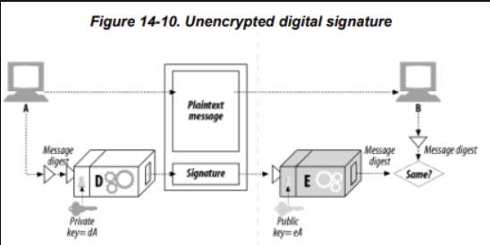

# 14.5 디지털 서명

### 암호체계
- 메시지 암호화
- 메시지 해독
- 메시지 저자
- 위조되지 않음을 증명하기 위한 서명

## 14.5.1 서명은 암호 체크섬이다
 : 메시지에 붙어있는 특별한 암호 체크섬

[ 이점 ]
- 메시지를 작성한 저자를 알려줌. (체크섬은 저자의 개인 서명처럼 동작.)
- 메시지 위조를 방지함. 

 

디지털 서명은 보통 비대칭 공개키에 의해 생성됨.

