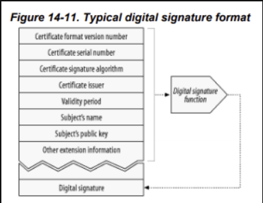

# 14.6 디지털 인증서
 : 신뢰할 수 있는 기관으로부터 보증받은 사용자나 회사에 대한 정보를 담음.

 

 ## 14.6.1 인증서 내부
★ 디지털 인증서는 공식적으로 '인증 기관'에 의해 디지털 서명된 정보의 집합 또한 담음.
- 대상의 이름
- 유효 기간
- 인증서 발급자
- 인증서 발급자의 디지털 서명

추가적으로, 대상과 사용된 서명 알고리즘에 대한 서술적인 정보 + 보통 대상의 공개키도 담음.

<b>[ 일반적인 디지털 서명의 포맷 ]

 

## 14.6.2 X.509 v3 인증서
> 여러 가지의 디지털 인증서들이 존재하는데, 이들의 정보를 X.509가 표준화된 서식에 저장하고 있다.

X.509 v3 인증서는 인증 정보를 파싱 가능한 필드에 넣어 구조화하는 표준화된 방법을 제공.

- 웹 서버 인증서
- 클라이언트 이메일 인증서
- 소프트웨어 코드 사인 인증서
- 인증기관 인증서

등 변종이 있음.

 

## 14.6.3 서버 인증을 위해 인증서 사용하기
    1. 사용자가 HTTPS를 통한 안전한 웹 트랜잭션을 시작
    2. 최신 브라유저는 자동으로 접속한 서버에서 디지털 인증서를 가져옴.
    3-1. 서버가 인증서를 가지고 있지 않다면, 보안 커넥션 실패
    3-2. 인증서를 받으면, 서명 기관을 검사
    4-1. 신뢰할만한 서명 기관이라면 공개키로 서명 검증.
    4-2. 신뢰할만 하지 않다면 서명 기관을 신뢰하는지 확인하기 위한 대화상자 보여줌.