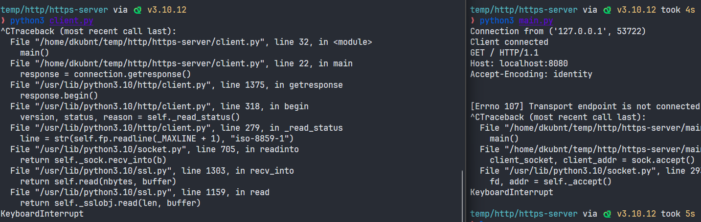

# 14.8 Real HTTPS Client

> 씨언어 코드를 읽다가 포기하고 직접 파이썬으로 HTTPS 서버와 클라이언트를 작성해봤습니다.

## HTTPS Server

```python
import socket
import ssl

def handle_client(connection):
    try:
        print("Client connected")
        while True:
            data = connection.recv(1024)
            if not data:
                break
            print(data.decode())
    except Exception as e:
        print(e)
    finally:
        connection.shutdown(socket.SHUT_RDWR)
        connection.close()

def main():
    # Set up the socket
    try:
        sock = socket.socket(socket.AF_INET, socket.SOCK_STREAM, 0)
        sock.setsockopt(socket.SOL_SOCKET, socket.SO_REUSEADDR, 1)  # Reuse the socket
        sock.bind(('localhost', 8080))
        sock.listen(5)  # Start listening for connections

        context = ssl.create_default_context(ssl.Purpose.CLIENT_AUTH)
        context.load_cert_chain(certfile="cert.pem", keyfile="key.pem")  # Load your certificate and private key

        while True:
            client_socket, client_addr = sock.accept()  # Accept a new connection
            print("Connection from", client_addr)

            # Wrap the client's socket with SSL
            client_socket_ssl = context.wrap_socket(client_socket, server_side=True)
            try:
                handle_client(client_socket_ssl)  # Handle the client
            except Exception as e:
                print(e)
                client_socket_ssl.close()
    finally:
        sock.close()

if __name__ == '__main__':
    main()
```

## HTTPS Client

```python

import http.client
import ssl

def main():
    # Define the host and the port to connect to
    host = "localhost"
    port = 8080

    # Create an SSL context
    # For unverified SSL certificates, uncomment the line below
    context = ssl._create_unverified_context()
    # context = ssl.create_default_context()

    # Create a connection
    connection = http.client.HTTPSConnection(host, port, context=context)

    # Make a simple GET request
    connection.request("GET", "/")

    # Get the response
    response = connection.getresponse()
    print("Status: {} and reason: {}".format(response.status, response.reason))

    # Read and print out the response body
    print(response.read().decode())

    # Close the connection
    connection.close()

if __name__ == "__main__":
    main()

```

## 실행 결과

```sh
 openssl req -x509 -newkey rsa:4096 -keyout key.pem -out cert.pem -days 365 -nodes
```

위 명령어를 통해 서버 인증서를 발급하고

```sh
# tmux 1
python server.py

# tmux 2
python client.py
```

위와 같이 파이썬 코드를 실행하면?



사진과 같이 아주 잘 동작합니다! 에러 메세지는 프로그램들을 Ctrl-C로 끌 때 발생한 것입니다.

무슨 일이 발생하냐면...

- handshake 파라미터 등을 포함한 로컬 컨텍스트를 만든다.
- 호스트 이름을 아이피 주소로 바꾼다.
- 443 포트를 통해 TCP 연결한다.
- SSL_new 와 SSL_set-fd를 통해 SSL layer를 붙이고, SSL_connect를 통해 핸드셰이크한다. 이를 통해 암호를 선택하고 인증서를 교환한다.
- SSL_write을 통해 일반적인 HTTP request를 보낼 수 있다.
- SSL_read를 통해 응답을 받는다.

## OpenSSL Client를 실행한 결과

```
(3) TCP connection open to host 'clients1.online.msdw.com', port 443
(4) SSL endpoint created & handshake completed
(5) SSL connected with cipher: DES-CBC3-MD5
(6) server's certificate was received:
subject: /C=US/ST=Utah/L=Salt Lake City/O=Morgan Stanley/OU=Online/CN=
clients1.online.msdw.com
issuer: /C=US/O=RSA Data Security, Inc./OU=Secure Server Certification
Authority
```

이를 통해 알 수 있는 것은?
