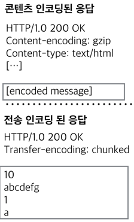

# 15.6 전송 인코딩과 청크 인코딩
메시지 데이터가 네트워크를 통해 **전송되는 방법**을 바꾸기 위해 전송 인코딩을 메시지에 적용할 수 있다.

 

### 15.6.1 안전한 전송
전송 인코딩은 **안전한 전송**을 위해 존재

**[ 문제를 일으키는 이유 ]**
- **알 수 없는 크기** : 메시지 본문의 최종 크기를 판단할 수 없다.
- **보안** : 하지만 SSL과 같은 유명한 전송 계층 보안 방식이 있어 전송 인코딩 보안은 흔하지 않다.

 

### 15.6.2 Transfer-Encoding 헤더

**[ 전송 인코딩을 제어하고 서술하는 헤더 ]**

- **Transfer-Encoding**
    
    : 어떤 인코딩이 메시지에 **적용**된지 **수신자**에게 알려준다.
    
- **TE**
    
    : 어떤 확장된 전송 인코딩을 **사용할 수** 있는지 **서버**에게 알려준다.
    

**[ 특징 ]**

- 모든 전송 인코딩 값은 대소문자가 구별됨.
- TE헤더는 어떤 형태의 전송 인코딩을 선호하는지 표현하는 Q값을 가질 수 있다. (단, 0.0은 금지)

 

### 15.6.3 청크 인코딩

**청크 인코딩** : 메시지를 일정 크기의 **청크 여럿으로 쪼갠**다.

- 순차적으로 보냄.
- 전체 크기를 알 수 없음. (알 필요 x)
- 본문이 동적으로 생성
- 청크의 크기를 콘텐츠와 함께 전송
- 멀티파트 인코딩(본문 속성)과 분리됨. (청크는 메시지 속성)

**[ 본문 끝 판별하는 방법 ]** 

- 서버와 클라이언트의 **커넥션이 지속적이지 않는** 경우
    - 커넥션을 닫음.
- 서버와 클라이언트의 **커넥션이 지속적인** 경우
    - Content-Length 헤더에 길이로 판별. (한번에 데이터 보내는 경우)
    - 메시지 본문에 청크가 0인 메시지를 날림. (동적으로 데이터 생성되는 경우)

⇒ 클라이언트는 서버가 청크 인코딩을 사용할 수 있을지 없을지 모르기 때문에 청크 요청이 거절되는 411 Length Required 에러가 나지 않으려면 1. 서버 지원 확인, 2. Content-Length 지정, 3. TransFer-Encoding 서정하는 방법 중 1개로 대비해야 함.

 

**[ 청크 메시지에 트레일러 추가할 수 있는 조건 ]**

- 클라이언트의 **TE헤더가 트레일러를 받아들일 수 있음**을 나타내는 경우
- 트레일러가 응답을 만든 **서버에 의해 추가** 되었으며, 클라이언트가 트레일러를 **무시하고 버려도** 되는 경우

+) **트레일러** : 메시지 시작 시점에서는 그 **값을 알 수 없는 추가적인 헤더 필드**를 담을 수 있다.

 

### 15.6.4 콘텐츠와 전송 인코딩의 조합

**콘텐츠 인코딩**과 **전송 인코딩**은 **동시**에 사용 가능하다.

ex)

1. 송신자가 콘텐츠 인코딩으로 HTML 파일 압축 (송신자)
2. 그 청크 데이터를 전송 인코딩을 사용해 전송 (송신자)
3. 수신자가 받은 데이터를 합침 (수신자)
4. 합친 데이터의 압축을 풀기 (수신자)

 

### 15.6.5 전송 인코딩 규칙

**[ 메시지 본문에 전송 인코딩을 적용할 때 규칙 ]**

- 전송 인코딩의 집합은 반드시 ‘**chunked**’를 포함해야 한다. (단, **커넥션의 종료**로 끝나는 메시지 제외.)
- 청크 전송이 사용되었다면, 베시지 본문에 적용된 **마지막 전송 인코딩이 존재**해야 한다.
- 청크 전송 인코딩은 반드시 메시지 본문에 **한 번 이상 적용**되어야 한다.

⇒ 만약 서버가 **이해할 수 없는 전송 인코딩**된 메시지를 받으면, **501 Unimplemented** 상태 코드로 응답해야 한다.