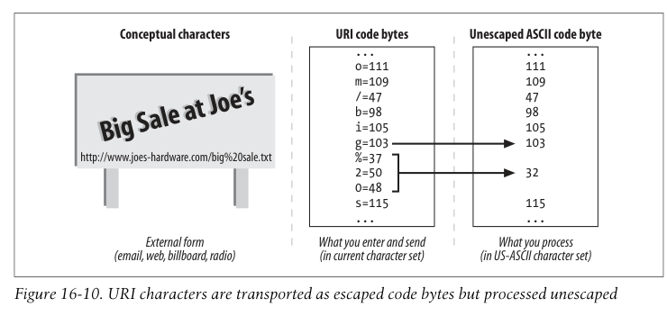

# 16.5 Internalized URIs

URI는 ascii 문자만 지원합니다.

## Global Transcribability Versus Meaningful Characters

아쉽게도 ascii만 사용할 수 있다는 내용 생략
략

## URI Character Repertoire

아스키 중에서도 예약어는 사용하면 안됩니다.

```
;
/
?
:
@
&
=
+
$
,
%
<HEX>
```

## Escaping and Unescaping

Escape를 통해 지원되지 않는 문자들을 안전하게 URI에서 사용할 수 있는 방법을 제공합니다.

% 다음에 16진수 숫자 두 개로 이루어진 세 문자 시퀀스를 사용하면 됩니다.

예를 들어, 공백 (아스키로 32)를 삽입하려면 "%20"을 사용하면 됩니다.



## Escaping International Characters

국제 문자도 이스케이프할 수 있습니다.

그런데, 0부터 127 사이에 있는 코드까지만 정의할 수 있고, 214 같은 애들은 사용되면 안됩니다.

쓰고 싶으면 UTF-8 인코딩 같은 것을 사용해서 %C3%96 등으로 표현해야 합니다.

## Modal Switches in URIs

ESC를 통해서 인코딩을 전환하는 방법도 있는데 생략
