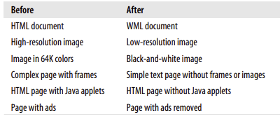
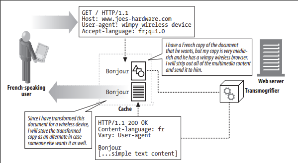

# 17.5 트랜스 코딩

**트랜스 코딩**: 서버가 클라이언트의 요구에 맞는 **문서를 아예 갖고 있지 않다**면 이론적으로 서버는 기존의 문서를 클라이언트가 사용할 수 있는 **무언가로 변환**할 수 있다.

[ **트랜스코딩 종류** ]

- 포맷 변환
- 정보 합성
- 내용 주입

[ **가상의 트랜스코딩** ]

## 17.5.1 포맷 변환

**포맷 변환**: 데이터를 클라이언트가 볼 수 있도록 한 포맷에서 다른 포매승로 변환하는 것

- 내용 협상 헤더에 의해 주도된다.
- 내용 변환 혹은 트랜스코딩은 콘텐츠 인코딩이나 전송 인코딩과는 다르다.
    - (콘텐츠를 특정 접근 장치에서 볼 수 있도록 하기 위한 것) vs (콘텐츠의 더 효율적인 혹은 안전한 전송을 위한 것)
    

## 17.5.2 정보 합성

**정보 합성**: 문서에서 정보의 요점을 추출하는 것

- 트랜스코딩 과정에서 유용할 수 있다.
- 자동화된 웸페이지 분류 시스템에 의해 종종 사용된다.

## 17.5.3 콘텐츠 주입

**내용 주입 트랜스코딩**: 웹 문서의 양을 늘리는 것.

- 현재 관련이 있거나 어떻게든 특정 사용자를 대상으로 하는 광고를 그때그때 효과적으로 삽입하기 위해 동적으로 이루어진다.

## 17.5.4 트랜스코딩 vs 정적으로 미리 생성해놓기

트랜스코딩의 대안이 웹 서버에서 웹페이지의 **여러 가지 사본**을 만드는 것인데, 이는 작은 변환도 여러 페이지의 수정을 요구하며 더 많은 공산을 요구하는 등 **프로그래밍하기 어렵다.**

⇒ 루트 페이지를 그때그때 필요할 때마다 변환하는 것은 정적으로 미리 생성해 놓는 것보다 더 쉬운 해결책이다.

- 콘텐츠를 제공할 때 대기시간 증가로 비용을 초래할 수 있지만 제삼자(싼 프락시, 캐시에 있는 외부 이에전트)에게 수행하게 하여 웹 서버의 부담을 덜 수 있다.

